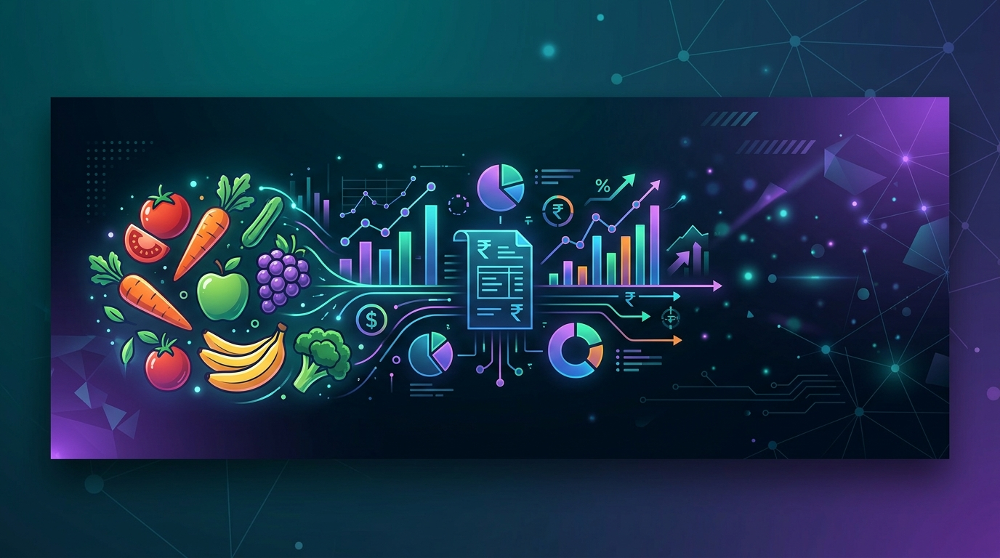
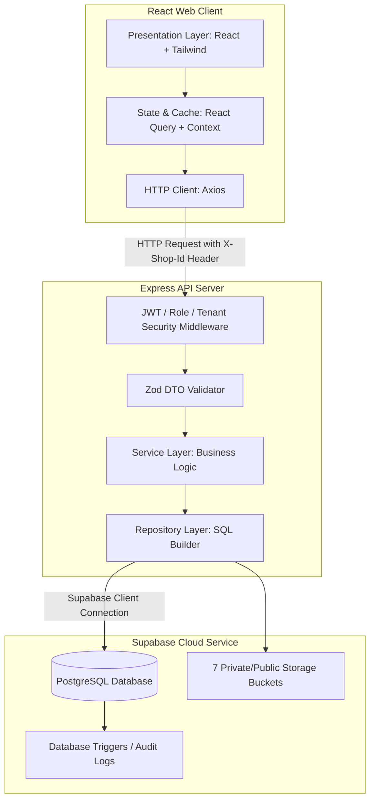

# 🍉 Raju Wholesale Fruits & Vegetables ERP

<p align="center">
  
</p>

<p align="center">
  <a href="https://github.com/vidyavarshinig15/fruit-vegetable-erp/actions"></a>
  <a href="https://fruit-vegetable-erp-frontend-six.vercel.app/"></a>
  <a href="https://supabase.com/"></a>
  <a href="https://playwright.dev/"></a>
</p>

---

## 🔗 Live Application Link

Experience the system live here:  
👉 **[https://fruit-vegetable-erp-frontend-six.vercel.app/](https://fruit-vegetable-erp-frontend-six.vercel.app/)**

---

## 📋 Project Overview

**Raju Wholesale Fruits & Vegetables ERP** is a production-grade, multi-tenant enterprise resource planning (ERP) suite designed specifically for large-scale fruit and vegetable wholesale operations. It manages complex invoicing, credit holds, double-entry financial ledger accounts, OCR-driven PDF inbound orders, spline-based business growth analytics, automated backup/restore utilities, and communications (via SMTP/Meta WhatsApp API).

> [!IMPORTANT]
> **Key Architectural Constraint: Zero Tax, Zero GST, Zero Discount**  
> The business operates under a strict net wholesale pricing model. There are **no** fields, variables, database columns, or computations for GST, taxes, discounts, or service charges anywhere in the application. All balances and ledger records reflect absolute net values.

---

## ⚡ Key Features

*   **🔒 Strict Multi-Tenant Shop Isolation:** Supports three completely independent shops under a single database with absolute data boundaries:
    1. **RAJ FRUITS AND VEGETABLES**
    2. **G R FRUITS AND VEGETABLES**
    3. **PRIYAKRISHNA FRUITS AND VEGETABLES**
*   **🤖 OCR-Assisted PDF Inbound Orders:** Automatically parse incoming order lists, handle spelling corrections using a "Smart Order Assist" search algorithm, and checkout invoices dynamically.
*   **💳 Live Credit Hold Enforcement:** Restricts checkout processes automatically if an order exceeds the customer's available credit limit (`Invoice Total + Current Customer Balance > Credit Limit`).
*   **📈 Chronological Ledger Ledger & Analytics:** Double-entry journal ledgers recording all transactions chronologically with SVG spline charts plotting sales growth, customer retention, and collections.
*   **💬 Automated Communication Channels:** PDF sharing and notifications pushed to clients via SMTP/Resend mailers and the Meta Cloud WhatsApp API.
*   **💾 Admin Backup & Recovery Tool:** Self-contained JSON-based dump & restore systems permitting admins to secure data backups or restore to a stable checkpoint.
*   **🧪 End-to-End E2E Test Suite:** Playwright tests verifying complex real-world checkout flows, ledger adjustments, collection actions, and credit constraints.

---

## 📐 System Architecture

The application is structured as an ESM monorepo using NPM Workspaces:



### Data Isolation & Header Routing
*   **Shop Context Header:** The frontend injects an `X-Shop-Id` header into all network queries.
*   **Tenant Column Isolation:** Operational tables include a `shop_id` foreign key. Repositories automatically append `WHERE shop_id = :active_shop` to all SQL mutations.
*   **Cache Cleansing:** When a user switches shops in the UI, the React Query Client cache is cleared, ensuring no cross-shop memory leaks.

---

## 📁 Repository Structure

```
├── shared/                  # Common TypeScript interfaces, models, and Zod schemas
│   ├── src/types/           # Shared enums (role permissions, ledger types, analytics metrics)
│   └── src/index.ts         # Module entrypoint & type exports
├── backend/                 # Node.js + Express API server
│   ├── src/controllers/     # Request flow routers (Ledgers, Analytics, Backup/Restore)
│   ├── src/repositories/    # Database query builders & Supabase clients
│   ├── src/services/        # SMTP mailers, WhatsApp API wrappers, OCR processors
│   └── src/index.ts         # Express server pipelines & middleware setup
├── frontend/                # React.js + Vite + TailwindCSS client dashboard
│   ├── src/pages/           # Billing checkout, OCR verifications, Reports, System Settings
│   ├── src/components/      # Reusable UI elements & Floating notification alerts
│   └── src/app/             # Router endpoints and global application state
└── supabase/                # PostgreSQL tables, indexes, policies, and seed scripts
    └── migrations/          # Chronological DB migrations (00001 to 00007)
```

---

## 🗄️ Database Migrations

The database is built on Supabase PostgreSQL and organized into chronological migration steps. Apply migrations in order:

1.  [`00001_initial_schema.sql`](file:///Users/vidyavarshini/Desktop/billing/supabase/migrations/00001_initial_schema.sql) — Initializes database extensions (e.g., `pg_trgm` for fast GIN search), core enums, and utility functions.
2.  [`00002_create_tables.sql`](file:///Users/vidyavarshini/Desktop/billing/supabase/migrations/00002_create_tables.sql) — Creates the 26 core tables, foreign keys, and audit attributes.
3.  [`00003_indexes_and_constraints.sql`](file:///Users/vidyavarshini/Desktop/billing/supabase/migrations/00003_indexes_and_constraints.sql) — Builds composite B-Tree indexes and GIN trigram indexes for sub-10ms query execution on names/phone numbers.
4.  [`00004_seed_data.sql`](file:///Users/vidyavarshini/Desktop/billing/supabase/migrations/00004_seed_data.sql) — Populates default wholesale tenant profiles, admin authorization roles, permissions, and base configurations.
5.  [`00005_rls_security_policies.sql`](file:///Users/vidyavarshini/Desktop/billing/supabase/migrations/00005_rls_security_policies.sql) — Declares Supabase Row Level Security (RLS) policies targeting tenant isolation.
6.  [`00006_storage_buckets.sql`](file:///Users/vidyavarshini/Desktop/billing/supabase/migrations/00006_storage_buckets.sql) — Sets up the 7 isolated file buckets for invoices, receipts, and order sheets.
7.  [`00007_audit_triggers.sql`](file:///Users/vidyavarshini/Desktop/billing/supabase/migrations/00007_audit_triggers.sql) — Binds database modification log triggers to record secure transaction logs.

---

## 🛠️ Getting Started Locally

### Prerequisites
*   Node.js v20.x or higher
*   NPM v10.x or higher
*   Supabase CLI (optional, for local development)

### 1. Installation
Clone the repository and install project-wide dependencies using workspaces:
```bash
npm install
```

### 2. Configure Environment Variables
Create a `.env` file in the root workspace and under `backend/` using the `.env.example` templates.

Root/Backend `.env` Configuration:
```env
PORT=5001
NODE_ENV=development
SUPABASE_URL=https://your-supabase-project.supabase.co
SUPABASE_SERVICE_ROLE_KEY=your-supabase-service-role-key
JWT_SECRET=your-jwt-auth-token-signing-secret
CORS_ORIGIN=http://localhost:5173
```

Frontend `.env` Configuration:
```env
VITE_API_URL=http://localhost:5001
```

### 3. Build Shared Modules
The project uses a shared library package. Build it before starting frontend or backend tasks:
```bash
npm run build:shared
```

### 4. Running the Development Server
Launch both the Express backend and React frontend concurrently:
```bash
npm run dev
```
*   **Frontend Dashboard:** Available at `http://localhost:5173`
*   **Backend Server Port:** Listens on `http://localhost:5001`

---

## 🧪 Running E2E Tests

The system uses Playwright for comprehensive End-to-End coverage. Tests are stored inside [`frontend/e2e/`](file:///Users/vidyavarshini/Desktop/billing/frontend/e2e).

1.  **Install Playwright browser binaries:**
    ```bash
    npx playwright install
    ```
2.  **Ensure local servers are active:**
    ```bash
    npm run dev
    ```
3.  **Execute the E2E suite:**
    ```bash
    npm run test:e2e
    ```

---

## 🚀 Production Deployment

### Database
1. Create a production PostgreSQL database instance via Supabase.
2. Run database migrations [`00001` through `00007`](file:///Users/vidyavarshini/Desktop/billing/supabase/migrations/) sequentially in the Supabase SQL editor.
3. Configure storage bucket access policies to match your file-sharing preferences (invoices and receipts).

### Backend Server
1. Provision a Node.js-compatible server environment (e.g., Heroku, Render, AWS ECS).
2. Populate production environment keys inside the server container (.env).
3. Run the following compile script:
   ```bash
   npm run build
   npm --prefix backend start
   ```

### Frontend Client
1. Deploy the Single Page React application on Vercel, Netlify, or AWS Amplify.
2. Build commands:
   * **Build Command:** `npm run build`
   * **Output Directory:** `frontend/dist`
   * **Root Directory:** `./`

---

## 💾 Administration & Data Backups

The system includes a dedicated control panel for database maintenance.

*   **Database Exports:** Administrators can download complete snapshots containing shops, customers, invoices, ledger entries, settings, and billing histories as a localized `.json` backup file.
*   **Disaster Recovery:** A backup file can be uploaded via the dashboard UI. The backend runs transaction blocks, resetting target tenant parameters and performing batch inserts to restore the shop to the snapshot state safely.

---

## 📄 License
This project is proprietary software. All rights reserved by Raju Wholesale Fruits & Vegetables Enterprise.
