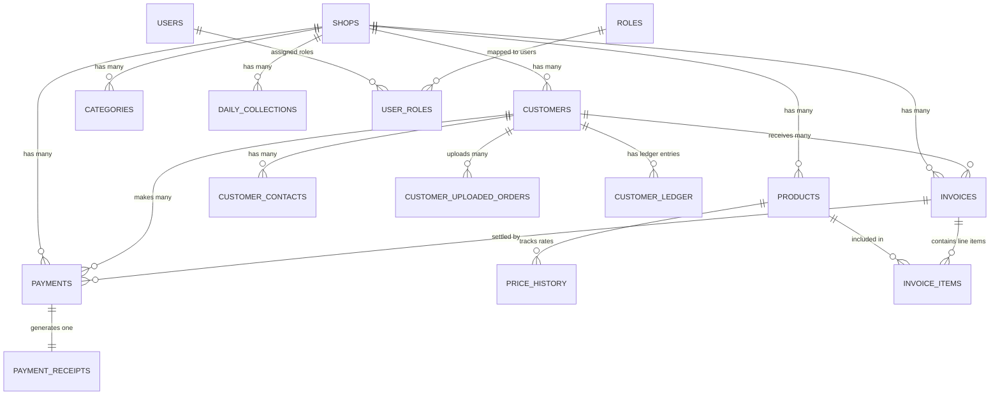

# Database Architecture & Supabase Specification

## Project Overview
**RAJU VEGETABLES AND FRUITS** - Wholesale Billing & Customer Management System

This document specifies the complete production database design, entity relationship diagrams (ERD), table structures, Supabase storage bucket layout, indexes, constraints, audit systems, Row Level Security (RLS) policies, and database migration order.

---

## Key Constraints & Guarantees

1. **Zero Tax / Zero GST / Zero Discount Policy**:
   - In accordance with business rules, **NO** GST, tax, VAT, discount, GSTIN, HSN, or tax-reporting fields exist anywhere in the database schema.
2. **Multi-Tenant Shop Isolation**:
   - The system supports 3 completely isolated wholesale shops:
     - `RAJ_FRUITS_AND_VEGETABLES`
     - `G_R_FRUITS_AND_VEGETABLES`
     - `PRIYAKRISHNA_FRUITS_AND_VEGETABLES`
   - Every operational table contains `shop_id` with foreign key enforcement and row-level security policy isolation.
3. **Standard Audit Metadata on Every Table**:
   - `id`: UUID Primary Key (`gen_random_uuid()`)
   - `created_at`: `TIMESTAMPTZ NOT NULL DEFAULT NOW()`
   - `updated_at`: `TIMESTAMPTZ NOT NULL DEFAULT NOW()`
   - `created_by`: `UUID REFERENCES users(id)`
   - `updated_by`: `UUID REFERENCES users(id)`
   - `is_deleted`: `BOOLEAN NOT NULL DEFAULT FALSE`
   - `deleted_at`: `TIMESTAMPTZ`
   - `deleted_by`: `UUID REFERENCES users(id)`
   - `status`: `VARCHAR(50) NOT NULL DEFAULT 'active'`

---

## 1. Complete Database Schema (26 Production Tables)

### Table Directory
1. `shops` - Shop entity profiles
2. `roles` - System access roles
3. `permissions` - System permission registry
4. `users` - System user accounts
5. `user_roles` - User to role and shop assignment
6. `categories` - Product classification per shop
7. `products` - Item catalog per shop
8. `customers` - Wholesale buyer accounts per shop
9. `customer_contacts` - Multiple contacts per customer
10. `price_history` - Rate change history per product
11. `customer_uploaded_orders` - Customer uploaded order PDFs/images
12. `invoices` - Wholesale bills/invoices per shop
13. `invoice_items` - Invoice bill line items
14. `payments` - Payment collection records per customer
15. `payment_receipts` - Receipts issued for payments
16. `customer_ledger` - Double-entry customer financial ledger
17. `daily_collections` - End-of-day daily collection aggregates
18. `business_settings` - Shop operational settings (print size, UPI, headers)
19. `language_settings` - User/Shop localization settings
20. `reports_cache` - Cached report & dashboard snapshots
21. `audit_logs` - Financial and operational audit trails
22. `notifications` - System and credit limit alerts
23. `activity_logs` - User action history (Print, Download, Share, Login)
24. `file_uploads` - Storage metadata registry
25. `backup_logs` - Database and storage backup logs
26. `system_settings` - Global platform configurations

---

## 2. Entity Relationship Diagram (ERD)



---

## 3. Core Table Relationships Summary

- **One Shop** $\rightarrow$ **Many Customers** (`customers.shop_id`)
- **One Customer** $\rightarrow$ **Many Uploaded PDFs** (`customer_uploaded_orders.customer_id`)
- **One Customer** $\rightarrow$ **Many Invoices** (`invoices.customer_id`)
- **One Invoice** $\rightarrow$ **Many Invoice Items** (`invoice_items.invoice_id`)
- **One Invoice** $\rightarrow$ **Many Payments** (`payments.invoice_id`)
- **One Payment** $\rightarrow$ **One Receipt** (`payment_receipts.payment_id` - Unique Constraint)
- **One Customer** $\rightarrow$ **Many Ledger Entries** (`customer_ledger.customer_id`)
- **One Product** $\rightarrow$ **Many Price History Records** (`price_history.product_id`)

---

## 4. Supabase Storage Architecture

### Storage Buckets (7 Buckets)

1. `customer-order-pdfs` (Private, max 15MB)
   - PDF & Image order sheets uploaded by customers for processing.
2. `generated-invoices` (Private, max 10MB)
   - PDF invoices generated by the backend billing engine.
3. `payment-receipts` (Private, max 10MB)
   - PDF receipts generated upon recording customer payment.
4. `business-logos` (Public, max 5MB)
   - Official shop logos and payment UPI QR code images.
5. `backup-files` (Private - Super Admin Only, max 100MB)
   - Database SQL dump archives and CSV exports.
6. `profile-pictures` (Public, max 5MB)
   - User account avatar images.
7. `documents` (Private, max 20MB)
   - Legal documents, licenses, and contracts.

### Storage Folder Path Structure

```
shop/{shop_id}/
├── customer/{customer_id}/
│   └── orders/{year}/{month}/{order_file_name}.pdf
├── invoice/{year}/{month}/
│   └── {invoice_number}.pdf
├── receipt/{year}/{month}/
│   └── {receipt_number}.pdf
├── backup/{year}/
│   └── backup_{timestamp}.zip
└── profile/{user_id}/
    └── avatar.png
```

---

## 5. Indexes Strategy for High Performance

Designed to maintain sub-10ms query execution across 100,000+ Invoices, 50,000+ Customers, and Millions of Ledger Entries:

- **Composite Shop Scoped Indexes**:
  - `idx_invoices_shop_date`: `(shop_id, invoice_date DESC) WHERE is_deleted = false`
  - `idx_invoices_shop_customer_date`: `(shop_id, customer_id, invoice_date DESC) WHERE is_deleted = false`
  - `idx_customer_ledger_shop_cust_date`: `(shop_id, customer_id, transaction_date DESC, created_at DESC) WHERE is_deleted = false`
- **GIN Trigram Fast Search Indexes**:
  - `idx_customers_name_trgm`: `customers USING gin(name gin_trgm_ops) WHERE is_deleted = false`
  - `idx_customers_mobile_trgm`: `customers USING gin(mobile_number gin_trgm_ops) WHERE is_deleted = false`
  - `idx_products_name_trgm`: `products USING gin(name gin_trgm_ops) WHERE is_deleted = false`
- **Unique Constraints**:
  - `(shop_id, invoice_number)`
  - `(shop_id, payment_number)`
  - `(shop_id, receipt_number)`
  - `(shop_id, customer_code)`
  - `(shop_id, collection_date)`

---

## 6. Security Design & Row Level Security (RLS)

1. **Shop Isolation**:
   - Helper function `user_has_shop_access(shop_id UUID)` validates if `auth.uid()` has permission for `shop_id` or is a Super Admin.
   - All CRUD queries on shop-scoped tables check `user_has_shop_access(shop_id)`.
2. **Physical Delete Restriction**:
   - `DELETE` policies on core financial tables (`invoices`, `customers`, `payments`) are restricted strictly to `SUPER_ADMIN`.
   - Routine deletions are soft deletes (`is_deleted = true`, `deleted_at = NOW()`, `deleted_by = auth.uid()`).
3. **Audit Logging System**:
   - Database triggers automatically append immutable audit records into `audit_logs` for `INVOICE_CREATED`, `PAYMENT_ADDED`, `RECEIPT_GENERATED`, `CUSTOMER_ADDED`, `CUSTOMER_UPDATED`, and `PRODUCT_UPDATED`.

---

## 7. Migration Order & Database Folder Structure

### Folder Structure
```
supabase/
└── migrations/
    ├── 00001_initial_schema.sql           # Extensions, Enums, Helper Functions
    ├── 00002_create_tables.sql           # 26 Production Tables & Constraints
    ├── 00003_indexes_and_constraints.sql # B-Tree, GIN Trigram Indexes & Check Constraints
    ├── 00004_seed_data.sql               # Seed 3 Shops, Roles, Permissions, Default Settings
    ├── 00005_rls_security_policies.sql   # Multi-Tenant RLS & Security Policies
    ├── 00006_storage_buckets.sql         # 7 Storage Buckets & Storage RLS Policies
    └── 00007_audit_triggers.sql          # Auto-updating triggers & Audit trail functions
```

---

## 8. Questions Required Before Module 3 (API & Backend Layer)

1. **Supabase Project Credentials**:
   - Have you created the Supabase Project and do you have `SUPABASE_URL`, `SUPABASE_ANON_KEY`, and `SUPABASE_SERVICE_ROLE_KEY` ready to set in `.env`?
2. **User Authentication Flow**:
   - Will staff accounts be pre-created by the Shop Admin, or should there be a self-registration option approved by Admin?
3. **Bill Numbering Sequence Policy**:
   - Should bill numbers (e.g. `RAJ-2026-00001`) reset to `00001` every financial year (April 1st) or remain strictly sequential forever?
4. **Thermal Printer Paper Size**:
   - What thermal printer models and paper widths (e.g. 2-inch / 58mm vs 3-inch / 80mm vs standard A4/A5) will be default for invoice generation in each shop?
